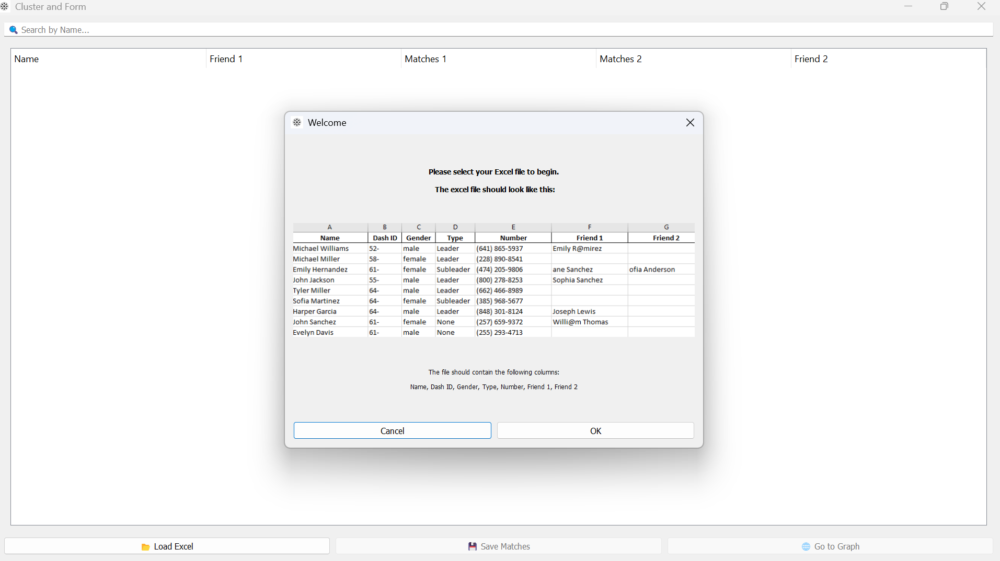
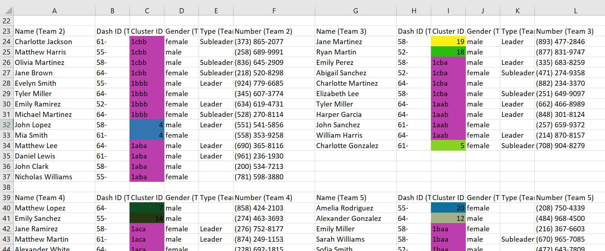

# Cluster and Form

> An intelligent team formation system that transforms the tedious process of organizing university activities into an automated, constraint-aware, and friend-preference-respecting solution.

A powerful tool for organizing university activities by automatically forming balanced teams while respecting friend preferences and team constraints.

## 🎯 Problem Statement

Organizing university activities often requires forming teams with multiple constraints:
- Teams should have roughly equal sizes
- Equal distribution of genders for fair play
- Mix of students from different university years
- Respect friend preferences when possible

Manually forming teams while considering all these constraints is time-consuming and error-prone. This tool automates the entire process, saving hours of manual work.

## ✨ Features

- **Excel Data Import**: Load participant data including names, phone numbers, types (leader/subleader), gender, year (dashID), and friend preferences
- **Smart Name Matching**: Automatically matches friend recommendations even with partial or slightly incorrect names
- **Interactive Friend Management**: Edit and verify friend connections through an intuitive table interface
- **Visual Cluster Analysis**: Interactive network graph visualization of friend clusters using pyvis and vis.js
- **Dynamic Graph Editing**: Add, delete, or modify connections directly in the graph view
- **Intelligent Team Formation**: Uses evolutionary programming to create balanced teams while respecting all constraints
- **Excel Export**: Generates color-coded Excel files with team assignments and cluster information

## 🛠️ Technical Stack

### Core Libraries
- **PyQt5**: GUI framework
  - QtWebEngineWidgets: For web-based graph visualization
  - QtWebChannel: For JavaScript-Python communication
- **pandas**: Data manipulation and Excel file handling
- **openpyxl**: Excel file generation and styling
- **pyvis**: Network graph visualization
- **numpy**: Numerical computations
- **lxml**: XML processing for graph data

### Key Functions

#### Data Management
- `load_excel_file()`: Imports participant data from Excel
- `get_matches()`: Smart name matching algorithm
- `edit_friend_column()`: Interactive friend connection management

#### Clustering
- `assign_clusters()`: DFS-based cluster formation
- `split_large_clusters()`: Ensures manageable cluster sizes

#### Team Formation
- `distribute()`: Initial team distribution
- `feasibility_check()`: Validates team constraints
- `fitness()`: Calculates team distribution score
- `generate_solutions()`: Evolutionary algorithm for optimal team formation

#### Visualization
- `create_graph()`: Generates interactive network visualization
- `export_teams_to_excel()`: Creates color-coded team assignments

## 📸 Screenshots

The following screenshots are required for the application to function properly.

#### Input Excel File


#### Friend Matches 


#### Search Table


#### Edit Friends Matches


#### Graph View


#### Edit Graph


#### Search Graph


#### Teams Excel Output



## 🚀 Installation

1. Clone the repository
2. Install required packages:
```bash
pip install -r requirements.txt
```

## 💻 Usage

1. Prepare your Excel file with the following columns:
   - Name
   - Dash ID
   - Gender
   - Type
   - Number
   - Friend 1
   - Friend 2

   *OR* use the ready-to-use excel file in test files folder

2. Run the application:
```bash
python cluster-and-form.py
```

3. Load your Excel file and verify friend matches
4. Use the graph view to visualize and edit clusters
5. Generate teams and export to Excel

## 🤝 Contributing

Contributions are welcome! Please feel free to submit a Pull Request.

## 👤 Author

Bassel Samir Tharwat
